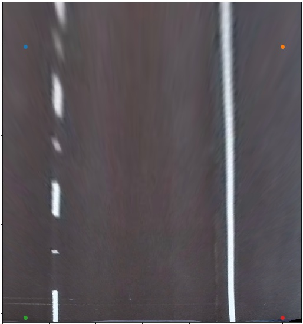

# ADVANCE LANE FINDING

In this project, your goal is to write a software pipeline to identify the lane boundaries in a video.


# PROJECT GOALS
---

The goals / steps of this project are the following:

* [x] Compute the camera calibration matrix and distortion coefficients given a set of chessboard images.
* [x] Apply a distortion correction to raw images.
* [x] Use color transforms, gradients, etc., to create a thresholded binary image.
* [x] Apply a perspective transform to rectify binary image ("birds-eye view").
* [x] Detect lane pixels and fit to find the lane boundary.
* [x] Determine the curvature of the lane and vehicle position with respect to center.
* [x] Warp the detected lane boundaries back onto the original image.
* [x] Output visual display of the lane boundaries and numerical estimation of lane curvature and vehicle position.

---

> The images for camera calibration are stored in the folder called `camera_cal`.  The images in `test_images` are for testing my pipeline on single frames.  To extract more test images from the videos, one can simply use an image writing method like `cv2.imwrite()`, i.e., one can then read the video in frame by frame as usual, and for frames if he/she want to save for later one can write to an image file.  


> To help the reviewer examine my work, I saved examples of the output from each stage of my pipeline in the folder called `output_images`, and include a description of what each image shows.    The video called `project_video.mp4` is the video your pipeline should work well on.  


## [I.] COMPUTING CAMERA MATRIC AND DISTORTION COEFFICIENT

The code for this step is contained in the first few code cell of the IPython notebook located in "./Advance Lane Finding.ipynb".

Camera calibration measures the distortion inherent in cameras that utilize lenses so that the images taken with the camera can be corrected by removing the distortion. The measure distortion function takes a Python sequence of checkerboard image filenames taken at different distances, center-offsets, and orientations. Checkerboard patterns are useful for this tasks because of their high contrast, known geometry, and regular pattern. 


I start by preparing "object points", which will be the (x, y, z) coordinates of the chessboard corners in the world. Here I am assuming the chessboard is fixed on the (x, y) plane at z=0, such that the object points are the same for each calibration image.  Thus, `objp` is just a replicated array of coordinates, and `objpoints` will be appended with a copy of it every time I successfully detect all chessboard corners in a test image.  `imgpoints` will be appended with the (x, y) pixel position of each of the corners in the image plane with each successful chessboard detection.  

I then used the output `objpoints` and `imgpoints` to compute the camera calibration and distortion coefficients using the `cv2.calibrateCamera()` function.  I applied this distortion correction to the test image using the `cv2.undistort()` function and obtained this result: 


## [II.] IMAGE PROCESSING PIPELINE (Road Model Images)


#### STEP 1. TRANSFORMING ROAD MODEL IMAGES TO DISTORTION-CORRECTED IMAGES

To demonstrate this step, I will describe how I apply the distortion correction to one of the test images like this one:


#### STEP 2. GENERATING BINARY-THRESHOLD IMAGES FOR LANE PIXELS (POINTS) DETECTION

Here we apply color and edge thresholding in this section to better detect the lines, and make it easier to find the lane points to fit a polynomial that best describes our left and right lanes later. Continuous experimentation by the task of the gradient thresholding and facilitating it with the changing color spaces we should adopt to increase our chances of detecting near perfect lanes-lines. Few Experiments that were carried out in this stage:


**A. GRADIENT THRESHOLDING**

* We use the Sobel operator to identify gradients, that is change in color intensity in the image. Higher values would denote strong gradients, and therefore sharp changes in color

* We experimented with many parameters and across different Sobel operations and came up with this final result shown below.


**B. COLOUR THRESHOLDING**

* We experiment with different color spaces to see which color space and channel(s) we should use for the most effective separation of lane lines. 

* On the RGB components, we see that the blue channel is worst at identifying yellow lines, while the red channel seems to give best results.

* For HLS and HSV, the hue channel produces an extremely noisy output, while the saturation channel of HLS seems to give the strong results; better than HSV’s saturation channel. conversely, HSV’s value channel is giving a very clear grayscale-ish image, especially on the yellow line, much better than HLS’ lightness channel.

> At this stage, we are faced with various choices that have pros and cons. Our goal here is to find the right thresholds on a given color channel to highlight yellow and white lines of the lane. There are actually many ways we could achieve this result, but we choose to use HLS because we already know how to set thresholds for yellow and white lane lines from Project 1: Simple Lane Detection. 


**C. COMBINED THRESHOLDING PIPELINE**

* I used a combination of color and gradient thresholds to generate a binary image (thresholding steps were carried out using function `thresholding_pipeline()` and `plot_combined_thresholding()`). Here's an example of my output for this step.

* On the left image, all green pixels were retained by our Sobel thresholding, while the blue pixels were identified by our HLS color thresholding. The results are very encouraging and it seems we have found the right parameters to detect lanes in a robust manner. We turn next to applying a perspective transform to our image and produce a bird’s eye view of the lane.


#### STEP 3. PERSPECTIVE TRANSFORMATION TO ACCURATELY FINDING LANE LINE'S AND IT'S CURVATURE

The code for my perspective transform includes a function called `warp()` and `plot_perspective_tranformed_img()`. The `warp()` function takes as inputs an image (`img`), as well as source (`src`) and destination (`dst`) points.  I chose the hardcode the source and destination points in the following manner:

```python
# Four source coordinates manually coded
    src = np.float32(
        [[577, 450],
         [720, 450],
         [200, 650],
         [1200, 650]])

# Four desired coordinates manually coded
    dst = np.float32(
        [[100, 100],
         [1200, 100],
         [100, 710],
         [1200, 710]])
```

* We now need to define a trapezoidal region in the 2D image using the above `src` points that will go through a perspective transformation  procedures to convert the image to a bird’s eye view, like in the below:


* This resulted in the following source and destination points:

| Source        | Destination   | 
|:-------------:|:-------------:| 
| 577, 450      | 100, 100      | 
| 720, 450      | 1200, 100     |
| 200, 650      | 100, 710      |
| 1200, 650     | 1200, 710     |

* I verified that my perspective transform was working as expected by drawing the `src` and `dst` points onto a test image and its warped counterpart to verify that the lines appear parallel in the warped image.





#### STEP 4. LANE BIFURCATION, DRIVABLE AREA MAPPING AND RADIUS OF CURVATURE

**A. PLOTTING OF HISTOGRAM TO CHECK FOR BINARY ACTIVATIONS**

* To decide explicitly which pixels are part of the lines and which belong to the left line and which belong to the right line. Plotting a histogram of where the binary activations occur across the image is one potential solution for this. 

* With this histogram we are adding up the pixel values along each column in the image. In our thresholded binary image, pixels are either 0 or 1, so the two most prominent peaks in this histogram will be good indicators of the x-position of the base of the lane lines.


**B. SLIDING WINDOW TO FIND PIXELS IN THE LANE**

* We can use that as a starting point for where to search for the lines. From that point, we can use a sliding window, placed around the line centers, to find and follow the lines up to the top of the frame.

* For better details about how exactly we did it, read line by line commented code inside the function `find_lane_pixels()`.


**C. FITTING A POLYNOMIAL 'N-degree'**

* Here we fit a polynomial for the detected left lane line points and right lane line points. We use fucntions namely `fit_polynomial()` to fit the appropriate degree polynomial and bifurcate the left and the right lane lines.

* Futher to visualize the detected lane lines and mark the drivable path on the bird eye view road, the area between the detected lane lines is then mapped with green colour and is mapped on to the original Image.


**D. COMBININIG PROCESSED IMAGE WITH THRESHED IMAGE**

* Here I reverse the perspective transformation applied previously and then I try to map the drivable area detected in the previous steps on the threshed image

* Futher to visualize the detected mapping as the drivable path down the road, the path map image and the gradient and colour threshed images are combined. Details in the function `reverse_warp()`


**E. FINDING RADIUS OF CURVATURE OF LANE LINES AND VEHICLE ALIGNMENT

* At this step I calculate the curvature of polynomial functions in the pixels i.e. the right and the left lane lines. Refer fucntion `measure_curvature_pixels()` for more details.

* Next the calculate the Relative vehicle alignment from the lane's center -- positive means rightwards deviation from lane's center and similarly negative means leftward deviation from lane's center.


### [III.] VIDEO PROCESSING PIPELINE (Road Model Videos)

#### A. FINAL OUTPUT VIDEO FOR THE TEST VIDEO

* For the test video the best fit happened with the three degree polynomial fit. Second degree polynomial fit was able to perfectly detect the lane lines near to the ego vehicle but as the distance from the vehicle increases it starts to fluctuate and sometimes was not able to map the lane lines properly.

* The above software created is robust to shadows from the sides of the roads, changing light conditions was also not able to bring about any significant change while mapping the lane lines.

Here's a [link to my test video result](test_output_videos/project_video_3rd_degree_output.mp4)

Here's a [link to my test video result](test_output_videos/project_video_2nd_degree_output.mp4)


#### B. FINAL OUTPUT VIDEO FOR THE CHALLENGE TEST VIDEO

* The software developed above is robust to shadows on the roads, changing colour or features of the road. The above software is still not robust to the glare due to the Sunny condition. 

* The above software is still not able to distinguish between the actual lane line and a cracked line on the road and is most likely to fail in such scenario. Also beacuse of the threshing mechanism used here the cracks in the lane gets higher activation peak and hence is detected as one of the lane line.

Here's a [link to my challenege_test video result](test_output_videos/challenge_video_3rd_degree_output.mp4)


#### C. FINAL OUTPUT VIDEO FOR THE HARDER CHALLENGE TEST VIDEO

* For harder challenge video a three degree polynomial fit was successfully able to map the lane lines in various parts of the video sequence. But a lot of parts gives a better fit with second degree polynomial fit. A code needs to be added which can help the software to smoothly switch between the degree of the polynomial fit.

* Because of the fixed attention window is used here, so the algorithm fails to detect lanes if parts of the lane go beyond that pre-fixed attention region. According to the smooth variation in degree mechanism, we can also move the two sides of the attention window accordingly. Doing this can help the software to focus it's attention to the region where the probability of finding the next lane line points is maximum. 

Here's a [link to my harder_challenge_test video result](test_output_videos/harder_challenge_video_3rd_degree_output.mp4)

---

### [IV.] DISCUSSIONS MOVING AHEAD

#### PROBLEMS AND ISSUES WITH THE EXUSTING PIPELINE AND HOW TO MAKE IT MORE ROBUST

This was an exciting, but rather difficult project, which felt very different from our previous projects. The long range of continuous experimentaion really took efforts and understanding of the concepts learned. We’ve covered how to perform camera calibration, color and gradient thresholds, as well as perspective transform and sliding windows to identify lane lines! The sliding windows code was particularly hard to understand initially but after long time debugging it and making comments (all available on my notebook) I finally understood every line!

**We believe there are many improvements that could be made to this project, such as:**

* Experiments with LAB and YUV color spaces to determine whether we can produce better color thresholding.

* Use convolutions instead of sliding windows to identify hot pixels. Convolutions will be faster and also computationally efficient.

* Implementing outlier rejection and use a low-pass filter to smooth the lane detection over frames, meaning add each new detection to a weighted mean of the position of the lines to avoid jitter. 

* Formulate a way so as to pass the lane information from previous frame to present frame such that our software know in advance or can calculate a fair expectation of where to look for the drivable lane area.

* Use of deep learning based techniques like semantic segmentation to map out the free space or the drivale area and hence providing flexiblility to the software or removing the fixated trapezoidal area approach to search for drivable area. 

* With the semantic segmentation based approach any disturbance in the lane line detection because of the objects in the environment can also be avoided using this appraoch. 

* Moreover, we need to build a much more robust pipeline to succeed on the two challenge videos that are part of this project.
