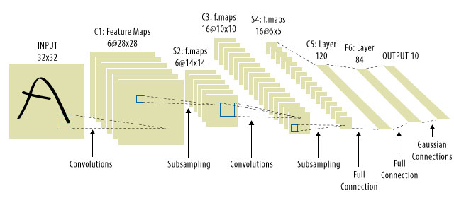

# Project: Build a Traffic Sign Recognition Classifier

---

## Step 1: Dataset Summary & Exploration

> The pickled data is a dictionary with 4 key/value pairs:
- `'features'` is a 4D array containing raw pixel data of the traffic sign images, (num examples, width, height, channels).
- `'labels'` is a 1D array containing the label/class id of the traffic sign. The file `signnames.csv` contains id -> name mappings for each id.
- `'sizes'` is a list containing tuples, (width, height) representing the original width and height the image.
- `'coords'` is a list containing tuples, (x1, y1, x2, y2) representing coordinates of a bounding box around the sign in the image. 

**THESE COORDINATES ASSUME THE ORIGINAL IMAGE. THE PICKLED DATA CONTAINS RESIZED VERSIONS (32 by 32) OF THESE IMAGES**

### [A.] The Basic Data Summary

> I used the pandas library to calculate summary statistics of the traffic signs data set:

    - Number of training examples = 34799
    - Number of testing examples = 12630
    - Image data shape = (32, 32, 3)
    - Number of classes = 43
    - Some more statistic info = (Class Name, Count, Label Name)

    No. of Images in class  0  : 180.0 	         Traffic Signal Label : Speed limit (20km/h)
    No. of Images in class  1  : 1980.0 	     Traffic Signal Label : Speed limit (30km/h)
    No. of Images in class  2  : 2010.0 	     Traffic Signal Label : Speed limit (50km/h)
    No. of Images in class  3  : 1260.0 	     Traffic Signal Label : Speed limit (60km/h)
    No. of Images in class  4  : 1770.0 	     Traffic Signal Label : Speed limit (70km/h)
    No. of Images in class  5  : 1650.0 	     Traffic Signal Label : Speed limit (80km/h)
    No. of Images in class  6  : 360.0 	         Traffic Signal Label : End of speed limit (80km/h)
    No. of Images in class  7  : 1290.0 	     Traffic Signal Label : Speed limit (100km/h)
    No. of Images in class  8  : 1260.0 	     Traffic Signal Label : Speed limit (120km/h)
    No. of Images in class  9  : 1320.0 	     Traffic Signal Label : No passing
    No. of Images in class 10  : 1800.0 	     Traffic Signal Label : No passing for vehicles over 3.5 metric tons
    No. of Images in class 11  : 1170.0 	     Traffic Signal Label : Right-of-way at the next intersection
    No. of Images in class 12  : 1890.0 	     Traffic Signal Label : Priority road
    No. of Images in class 13  : 1920.0 	     Traffic Signal Label : Yield
    No. of Images in class 14  : 690.0 	         Traffic Signal Label : Stop
    No. of Images in class 15  : 540.0 	         Traffic Signal Label : No vehicles
    No. of Images in class 16  : 360.0 	         Traffic Signal Label : Vehicles over 3.5 metric tons prohibited
    No. of Images in class 17  : 990.0 	         Traffic Signal Label : No entry
    No. of Images in class 18  : 1080.0 	     Traffic Signal Label : General caution
    No. of Images in class 19  : 180.0 	         Traffic Signal Label : Dangerous curve to the left
    No. of Images in class 20  : 300.0 	         Traffic Signal Label : Dangerous curve to the right
    No. of Images in class 21  : 270.0 	         Traffic Signal Label : Double curve
    No. of Images in class 22  : 330.0 	         Traffic Signal Label : Bumpy road
    No. of Images in class 23  : 450.0 	         Traffic Signal Label : Slippery road
    No. of Images in class 24  : 240.0 	         Traffic Signal Label : Road narrows on the right
    No. of Images in class 25  : 1350.0     	 Traffic Signal Label : Road work
    No. of Images in class 26  : 540.0 	         Traffic Signal Label : Traffic signals
    No. of Images in class 27  : 210.0 	    	 Traffic Signal Label : Pedestrians
    No. of Images in class 28  : 480.0 	    	 Traffic Signal Label : Children crossing
    No. of Images in class 29  : 240.0 		     Traffic Signal Label : Bicycles crossing
    No. of Images in class 30  : 390.0 	    	 Traffic Signal Label : Beware of ice/snow
    No. of Images in class 31  : 690.0 		     Traffic Signal Label : Wild animals crossing
    No. of Images in class 32  : 210.0 		     Traffic Signal Label : End of all speed and passing limits
    No. of Images in class 33  : 599.0 		     Traffic Signal Label : Turn right ahead
    No. of Images in class 34  : 360.0 	    	 Traffic Signal Label : Turn left ahead
    No. of Images in class 35  : 1080.0 	     Traffic Signal Label : Ahead only
    No. of Images in class 36  : 330.0 		     Traffic Signal Label : Go straight or right
    No. of Images in class 37  : 180.0 	    	 Traffic Signal Label : Go straight or left
    No. of Images in class 38  : 1860.0     	 Traffic Signal Label : Keep right
    No. of Images in class 39  : 270.0 		     Traffic Signal Label : Keep left
    No. of Images in class 40  : 300.0 		     Traffic Signal Label : Roundabout mandatory
    No. of Images in class 41  : 210.0 		     Traffic Signal Label : End of no passing
    No. of Images in class 42  : 210.0 		     Traffic Signal Label : End of no passing by vehicles over 3.5 metric tons

### [B.] Dataset Visualization
> Visualized the German Traffic Signs Dataset using the pickled file(s) which included: 

> plotting traffic sign images

> plotting the count of each sign

### [C.] Exploratory Analysis
> Here is an exploratory visualization of the data set. It is a bar chart showing how the grouping of the dataset for model training. Looking at the distributions graphs for training, validation and testing - they seem to be almost similar. Hence we can conclude that validation and testing set are a good representative (proxy) of the training dataset. Though the dataset have few classes with more examples then the others. This can be clearly observed in the Bar charts below. This tells us that the dataset we have is class imbalanced.

----

## Step 2: Design and Test a Model Architecture
> Implemented and tunned a LeNet model that learns to recognize traffic signs. It includes two convolutional layers and three fully-connected layers. Trained and tested the model on the [German Traffic Sign Dataset](http://benchmark.ini.rub.de/?section=gtsrb&subsection=dataset). There are various aspects that are considered when thinking about this problem:

- [x] Neural network architecture (is the network over or underfitting?)
- [x] Playing around with preprocessing techniques (normalization, rgb to grayscale, etc)
- [x] Number of examples per label (some have more than others), Handling Imbalanced Classes
- [x] Generate fake data.

### [A.] Preprocessing RGB images

- **Converting RGB images to Gray images:** I use mathematical computation to convert RGB image with 3 channels into Gray scale image with one single channel. Using Grayscale image has multiple advantages:

    * _small memory usage:_ For each pixel, RGB has 3 channels and each channel needs 8 bit storage, while grayscale use 8 bit only for one channel.
    * _color invariance:_ Traffic sign classifier is color invariant, that means it only need to detect edges inside the image and **color information doesn’t help.**
    * _difficulty of visualization:_ grayscale is easier to manipulate and visualize because it has two spatial dimensions and one brightness dimension. On the contrary, RGB has two spatial dimensions and three color dimensions.
    * _processing speed:_ grayscale images means less data, therby making it faster to be processed. It can save huge amount of time in video processing

- **Converting Gray images to Scaled / Normalized images:** The second step need the image data to be normalized so that the it has mean zero and equal variance. For image data, `(pixel - 128)/ 128` is a quick way to approximately normalize the data and can be used in this project. _This step changes the range of pixel intensity so all images can have consistent range for pixel values. The reason of normalization is following:

    * _model stability:_ skewed pixel values are harmful, because our model will multiply weights and add bias to these image pixels. If extremely large or small values are involved, both operations can amplify the skewness and cause large error.
    * _improve gradient calculation:_ model needs to calculate gradients in backward propagation. With skewed pixel values, gradient calculation can be out of control.

- **Converting Scaled Images to Contrast Stretched Images:** 3. Rescale Intensity as an experiment, I found above simple linear transform can be further improved with “exposure.rescale_intensity” method from skimage library. It uniformly rescaled image intensity to make pixel values inside consistent range and achieved better results. The reason of contrast stretching is following:

    * _rescaling intensity:_ images can have very different contrast due to glare, change of illumination intensity, or etc. It causes images either very bright or too dark, which is difficult to recognize.

### [B.] Fine tuning the Model Architecture
> Finally we fixated the model architecture here. Consider the figure / diagram below describing the final model. It includes visual description of model type, layers, layer sizes, connectivity, etc. We tuned the model and found that the following hyper-parameters gives the best results:

 - mu = 0
 - sigma = 0.1
 - dropout = 0.75
 - EPOCHS = 50
 - BATCH_SIZE = 256
 - learning rate = 0.001
 

### [C.] Train, Validate and Test the Model
A validation set is used to assess how well the model is performing. A low accuracy on the training and validation sets imply underfitting. A high accuracy on the training set but low accuracy on the validation set implies overfitting. To train the model, I used an Adam Optimizer with learning rate as mentioned above.

> **Training and validating the LeNet model** 

Though, I didn't made much changes to LeNet architecture and kept on fine tuning it. I got results above assignment's expectation so I didn't tried hard for tuning a altogehter different model architecture. Like adding or taking away layers (pooling, convolution, etc), using an activation function or changing the activation function. One common justification for adjusting an architecture would be due to overfitting or underfitting. A high accuracy on the training set but low accuracy on the validation set indicates over fitting; a low accuracy on both sets indicates under fitting.

Training and validating a model is an iterative approach. While building my first model I started training a LeNet Architecture with just 20 epochs, batch size of 256 and dropout of 0.25. I found that the train and validation accuracies were both low which means that my model was underfitting. 

Now I fixated dropout to 0.25, batch size of 256 and tried incresing epochs say 30, then 40, then 50, then 60 etc. Each time I observed a increase in training and validation accuracied until when I took it above 60. Though the model training and validation accuracies both went up so now the problem was the difference between them which was pretty high. Technically which mean this is a situation of overfitting. 

I knew that dropout techniques has a role to play in dealing with the possible overfitting. I tried increasing the dropout from 0.25, then 0.30, then 0.50, then 0.70, then 0.80 and keeping rest same from the previous step. I observed my model got corrected for overfitting. Now after many steps of tuning I found that the model which gives best results was with above stated hyperparameters.

    
**EPOCH 1 ...**

Validation Accuracy = 0.684

Train Accuracy = 0.743
    
**EPOCH 2 ...**

Validation Accuracy = 0.819

Train Accuracy = 0.886
    

...
...    
...
    

**EPOCH 49 ...**

Validation Accuracy = 0.959

Train Accuracy = 0.996
    
**EPOCH 50 ...**

Validation Accuracy = 0.959

Train Accuracy = 0.997

> **Calculating the test data accuracy with the saved Model saved**
From the graph below we can visualize the performance of the training pipeline. My final model results were:

* Training Set Accuracy  = 0.997
* Validation Set Accuracy  = 0.959 
* Test Set Accuracy  = 0.943

---

## Step 3: Test a Model on New Images downloaded form an external source
> To give yourself more insight into how your model is working, 
- downloaded at five pictures of German traffic signs from the web
- used our model to predict the traffic sign type

### [A.] Loading and Outputing the downloaded Images after resizing

> CLASS LABELS DESCRIPTION FOR TEST IMAGES FROM WEB 

- '14-stop.png'
- '33-turn_right_ahead.png'
- '15-no-vechicles.png'
- '12-priority-road.png'
- '.ipynb_checkpoints'
- '22-bumpy-road.png'

### [B.] Predicting the Sign Type for Each Image
> For example, if the model predicted 1 out of 5 signs correctly, it's 20% accurate on these new images.
- Running the predictions here and using the model to output the prediction and accuracy for each image.
- Pre-process the images with the same pre-processing pipeline used earlier
- Class Labels for the test images are: [14 33 15 12 22]
- The first image might be difficult to classify because it has a similarity with the No entry sign.

### [C.] Analyzing the Performance on images above
> Test Accuracy = 100.000 %

### [D.] Plotting and Priniting Top 5 Softmax Probabilities For Each Image Found on the Web
> Calculated the top 5 softmax probabilities for each image from the German traffic sign dataset found on the web. 

    ------------------------------------------------------------
    ------------------------------------------------------------
    
    	 True Label is: =    14:Stop                          
    
       14: Stop                           99.969%
       17: No entry                       0.031%
       32: End of all speed and passing limits 0.000%
       34: Turn left ahead                0.000%
       35: Ahead only                     0.000%
    ------------------------------------------------------------
    ------------------------------------------------------------

    ------------------------------------------------------------
    ------------------------------------------------------------
    
    	 True Label is: =    33:Turn right ahead              
    
       33: Turn right ahead               100.000%
       37: Go straight or left            0.000%
       14: Stop                           0.000%
        3: Speed limit (60km/h)           0.000%
       35: Ahead only                     0.000%
    ------------------------------------------------------------
    ------------------------------------------------------------

    ------------------------------------------------------------
    ------------------------------------------------------------
    
    	 True Label is: =    15:No vehicles                   
    
       15: No vehicles                    100.000%
       26: Traffic signals                0.000%
       36: Go straight or right           0.000%
       35: Ahead only                     0.000%
        9: No passing                     0.000%
    ------------------------------------------------------------
    ------------------------------------------------------------
  

    ------------------------------------------------------------
    ------------------------------------------------------------
    
    	 True Label is: =    12:Priority road                 
    
       12: Priority road                  100.000%
       30: Beware of ice/snow             0.000%
       32: End of all speed and passing limits 0.000%
       35: Ahead only                     0.000%
       40: Roundabout mandatory           0.000%
    ------------------------------------------------------------
    ------------------------------------------------------------

    ------------------------------------------------------------
    ------------------------------------------------------------
    
    	 True Label is: =    22:Bumpy road                    
    
       22: Bumpy road                     99.976%
       29: Bicycles crossing              0.022%
       26: Traffic signals                0.002%
       25: Road work                      0.000%
       31: Wild animals crossing          0.000%
    ------------------------------------------------------------

---

## Step 4 (Optional): Visualize the Neural Network's State with Test Images

For understaning the output of a neural network's weights we tried visualizing the neural network. While neural networks can be a great learning device they are often referred to as a black box. We can understand what the weights of a neural network look like better by plotting their feature maps. After successfully training our neural network we can see what it's **feature maps look like by plotting the output of the network's weight layers in response to a test stimuli image.** From these plotted feature maps, it's possible to see what characteristics of an image the network finds interesting. For a sign, maybe the inner network feature maps react with high activation to the sign's boundary outline or to the contrast in the sign's painted symbol.

For an example of what feature map outputs look like, check out NVIDIA's results in their paper [End-to-End Deep Learning for Self-Driving Cars](https://devblogs.nvidia.com/parallelforall/deep-learning-self-driving-cars/) in the section Visualization of internal CNN State. NVIDIA was able to show that their network's inner weights had high activations to road boundary lines by comparing feature maps from an image with a clear path to one without. Tried experimenting with a similar test to show that your trained network's weights are looking for interesting features, whether it's looking at differences in feature maps from images with or without a sign, or even what feature maps look like in a trained network vs a completely untrained one on the same sign image.

<figure>
 
 <figcaption>
 

 
 
 Your output should look something like this (above)
 
 </figcaption>
</figure>
 

 

**GOT THIS ERROR**

---------------------------------------------------------------------------

    <ipython-input-46-dcb048557f2e> in <module>()
    ----> 1 outputFeatureMap(x[11], conv2, activation_min=-1, activation_max=-1 ,plt_num=1)

    RuntimeError: Attempted to use a closed Session.

    ---------------------------------------------------------------------------
